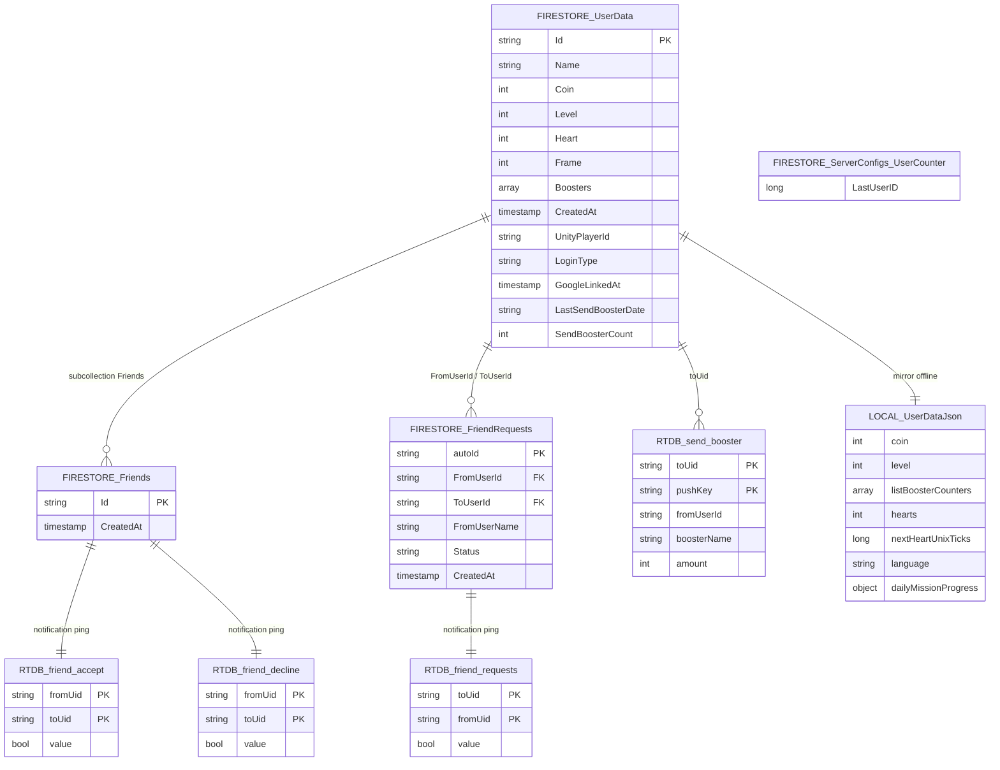

# BlockJam3D — Database Schema

Tài liệu này liệt kê **tất cả các bảng / collection / node** được sử dụng trong dự án, bao gồm 3 hệ thống lưu trữ: **Cloud Firestore**, **Firebase Realtime Database**, và **Local Storage** (JSON file + PlayerPrefs).

---

## 1. Cloud Firestore (Source of Truth)

### 1.1 `UserData/{uid}` — Hồ sơ người chơi

> **Collection**: `UserData`  
> **Document ID**: User ID (bắt đầu từ `10000000`)  
> **File tham chiếu**: [UserDataFirebaseManager.cs](file:///d:/Study/unity/BlockJam3D/Assets/Scenes/UserDataFirebaseManager.cs)

| Field | Type | Mô tả |
|---|---|---|
| `Id` | `string` | ID người chơi (document ID) |
| `Name` | `string` | Tên hiển thị |
| `Coin` | `int` | Số coin hiện có |
| `Level` | `int` | Level hiện tại |
| `Heart` | `int` | Số tim hiện có |
| `Frame` | `int` | Frame avatar đang dùng |
| `Boosters` | `array<map>` | Danh sách booster, mỗi phần tử: `{ name: string, count: int }` |
| `CreatedAt` | `Timestamp` | Thời điểm tạo tài khoản (server timestamp) |
| `UnityPlayerId` | `string` | *(Có khi liên kết Google)* Unity Player Account ID |
| `LoginType` | `string` | *(Có khi liên kết Google)* Loại đăng nhập, ví dụ `"Google"` |
| `GoogleLinkedAt` | `Timestamp` | *(Có khi liên kết Google)* Thời điểm liên kết Google |
| `Provider` | `string` | *(Có khi login Unity)* Provider name, ví dụ `"unity"` |
| `LastLoginAt` | `Timestamp` | *(Có khi login Unity)* Thời điểm đăng nhập gần nhất |
| `LastSendBoosterDate` | `string` | Ngày gửi booster gần nhất (format `yyyyMMdd`, timezone VN) |
| `SendBoosterCount` | `int` | Số lần gửi booster trong ngày (tối đa `MAX_SEND_PER_DAY = 3`) |

---

### 1.2 `UserData/{uid}/Friends/{friendId}` — Danh sách bạn bè

> **Subcollection** của `UserData/{uid}`  
> **Document ID**: ID của người bạn  
> **File tham chiếu**: [UserDataFirebaseManager.cs#L717-L761](file:///d:/Study/unity/BlockJam3D/Assets/Scenes/UserDataFirebaseManager.cs#L717-L761)

| Field | Type | Mô tả |
|---|---|---|
| `Id` | `string` | ID của người bạn |
| `CreatedAt` | `Timestamp` | Thời điểm trở thành bạn bè (server timestamp) |

> **Lưu ý**: Quan hệ bạn bè là hai chiều — khi A kết bạn với B, sẽ tạo cả `UserData/A/Friends/B` và `UserData/B/Friends/A` trong một `WriteBatch`.

---

### 1.3 `FriendRequests/{autoId}` — Lời mời kết bạn

> **Collection**: `FriendRequests`  
> **Document ID**: Auto-generated bởi Firestore (`AddAsync`)  
> **File tham chiếu**: [UserDataFirebaseManager.cs#L767-L805](file:///d:/Study/unity/BlockJam3D/Assets/Scenes/UserDataFirebaseManager.cs#L767-L805)

| Field | Type | Mô tả |
|---|---|---|
| `FromUserId` | `string` | ID người gửi lời mời |
| `ToUserId` | `string` | ID người nhận lời mời |
| `FromUserName` | `string` | Tên hiển thị người gửi |
| `Status` | `string` | Trạng thái: `"Pending"` |
| `CreatedAt` | `Timestamp` | Thời điểm gửi lời mời (server timestamp) |

> **Truy vấn chính**: `WhereEqualTo("ToUserId", myUserId).WhereEqualTo("Status", "Pending")`  
> **Lifecycle**: Document bị xóa (`.DeleteAsync()`) khi lời mời được chấp nhận hoặc từ chối.

---

### 1.4 `ServerConfigs/UserCounter` — Bộ đếm ID tuần tự

> **Collection**: `ServerConfigs`  
> **Document ID**: `UserCounter` (duy nhất)  
> **File tham chiếu**: [UserDataFirebaseManager.cs#L340-L383](file:///d:/Study/unity/BlockJam3D/Assets/Scenes/UserDataFirebaseManager.cs#L340-L383)

| Field | Type | Mô tả |
|---|---|---|
| `LastUserID` | `long` | ID lớn nhất đã cấp (bắt đầu từ `10000000`) |

> **Access pattern**: `RunTransactionAsync` — đọc → increment → ghi. Đảm bảo không bao giờ trùng ID giữa các client.

---

## 2. Firebase Realtime Database (Notification Bus)

> **URL**: `https://blockjam3d-2072f-default-rtdb.asia-southeast1.firebasedatabase.app`  
> **File tham chiếu**: [UserDataFirebaseManager.cs#L55-L76](file:///d:/Study/unity/BlockJam3D/Assets/Scenes/UserDataFirebaseManager.cs#L55-L76)  
> **Đặc điểm chung**: Tất cả các node đều là **one-shot** — bị xóa ngay sau khi client nhận (`RemoveValueAsync`).

### 2.1 `friend_requests/{toUid}/{fromUid}` — Thông báo lời mời kết bạn

| Field | Type | Mô tả |
|---|---|---|
| *(value)* | `bool` | Luôn là `true` |

> **Ghi**: `SetValueAsync(true)` khi gửi lời mời.  
> **Đọc**: Listener `ChildAdded` trên `friend_requests/{myUserId}`.  
> **Xóa**: `RemoveValueAsync` ngay sau khi nhận.

---

### 2.2 `friend_accept/{fromUid}/{toUid}` — Thông báo chấp nhận kết bạn

| Field | Type | Mô tả |
|---|---|---|
| *(value)* | `bool` | Luôn là `true` |

> **Ghi**: `SetValueAsync(true)` khi người nhận chấp nhận lời mời.  
> **Đọc**: Listener `ChildAdded` trên `friend_accept/{myUserId}`.  
> **Xóa**: `RemoveValueAsync` ngay sau khi nhận.

---

### 2.3 `friend_decline/{fromUid}/{toUid}` — Thông báo từ chối kết bạn

| Field | Type | Mô tả |
|---|---|---|
| *(value)* | `bool` | Luôn là `true` |

> **Ghi**: `SetValueAsync(true)` khi người nhận từ chối lời mời.  
> **Đọc**: Listener `ChildAdded` trên `friend_decline/{myUserId}`.  
> **Xóa**: `RemoveValueAsync` ngay sau khi nhận.

---

### 2.4 `send_booster/{toUid}/{pushKey}` — Thông báo tặng booster/heart

> **Document ID**: Auto-generated bởi `Push()`

| Field | Type | Mô tả |
|---|---|---|
| `fromUserId` | `string` | ID người gửi |
| `boosterName` | `string` | Tên booster (vd: `"Undo"`, `"Shuffle"`, `"Heart"`) |
| `amount` | `int` | Số lượng tặng |

> **Ghi**: `Push().SetValueAsync(...)` sau khi Firestore transaction thành công.  
> **Đọc**: Listener `ChildAdded` trên `send_booster/{myUserId}`.  
> **Xóa**: `RemoveValueAsync` ngay sau khi nhận và cập nhật local.

---

## 3. Local Storage — JSON File

### 3.1 `UserData.json` — Dữ liệu người chơi offline

> **Đường dẫn**: `Application.persistentDataPath/UserData.json`  
> **File tham chiếu**: [SaveDataManager.cs](file:///d:/Study/unity/BlockJam3D/Assets/Scripts/UserData/SaveDataManager.cs), [UserData.cs](file:///d:/Study/unity/BlockJam3D/Assets/Scripts/UserData/UserData.cs)  
> **Format**: JSON (qua `JsonUtility`)

| Field | Type | Mô tả |
|---|---|---|
| `coin` | `int` | Số coin (mặc định `99999` khi dev) |
| `level` | `int` | Level hiện tại (mặc định `1`) |
| `listBoosterCounters` | `array` | Danh sách booster: `[{ name: string, count: int }]` |
| `hearts` | `int` | Số tim hiện tại (mặc định `5`, tối đa `MAX_HEARTS = 5`) |
| `nextHeartUnixTicks` | `long` | Thời điểm hồi tim tiếp theo (UTC ticks, `0` = đầy tim) |
| `language` | `string` | Ngôn ngữ giao diện (`"en"` / `"vi"`) |
| `dailyMissionProgress` | `object` | Tiến trình nhiệm vụ hằng ngày (xem bảng 3.2) |

---

### 3.2 `dailyMissionProgress` — Cấu trúc con trong UserData.json

> **File tham chiếu**: [DailyMissionProgress.cs](file:///d:/Study/unity/BlockJam3D/Assets/Scripts/DailyMission/DailyMissionProgress.cs), [DailyMissionManager.cs](file:///d:/Study/unity/BlockJam3D/Assets/Scripts/DailyMission/DailyMissionManager.cs)

| Field | Type | Mô tả |
|---|---|---|
| `lastResetUtcTicks` | `long` | Thời điểm reset gần nhất (UTC midnight ticks, `0` = chưa seed) |
| `tasks` | `array` | Danh sách 3 nhiệm vụ trong ngày (xem bảng con bên dưới) |

**Mỗi phần tử trong `tasks`** (`MissionTaskProgress`):

| Field | Type | Mô tả |
|---|---|---|
| `missionId` | `string` | ID nhiệm vụ (tham chiếu đến `DailyMissionData` SO) |
| `currentCount` | `int` | Tiến trình hiện tại |
| `claimed` | `bool` | Đã nhận thưởng chưa |

---

## 4. Local Storage — PlayerPrefs

> **File tham chiếu**: [UserDataFirebaseManager.cs](file:///d:/Study/unity/BlockJam3D/Assets/Scenes/UserDataFirebaseManager.cs), [HeartManager.cs](file:///d:/Study/unity/BlockJam3D/Assets/Scripts/GameManager/HeartManager.cs)

| Key | Type | Mô tả |
|---|---|---|
| `PlayerID` | `string` | ID người chơi hiện tại |
| `PlayerName` | `string` | Tên người chơi hiện tại |
| `Hearts` | `int` | Số tim (legacy, dùng khi tạo user mới) |
| `Timer` | `float` | Timer hồi tim (legacy) |
| `LastQuitTime` | `string` | Thời điểm thoát game gần nhất (legacy, `DateTime.ToBinary()`) |
| `PreLinkLocalPlayerID` | `string` | *(Snapshot)* PlayerID trước khi link Google |
| `PreLinkLocalPlayerName` | `string` | *(Snapshot)* PlayerName trước khi link Google |
| `PreLinkLocalCoin` | `int` | *(Snapshot)* Coin trước khi link Google |

---

## 5. Tổng quan sơ đồ quan hệ

---

## 6. Tóm tắt tổng hợp

| # | Hệ thống | Bảng / Collection / Node | Loại | Mục đích |
|---|---|---|---|---|
| 1 | Firestore | `UserData/{uid}` | Collection | Hồ sơ người chơi (coin, level, heart, boosters, frame) |
| 2 | Firestore | `UserData/{uid}/Friends/{friendId}` | Subcollection | Quan hệ bạn bè (hai chiều) |
| 3 | Firestore | `FriendRequests/{autoId}` | Collection | Lời mời kết bạn đang chờ |
| 4 | Firestore | `ServerConfigs/UserCounter` | Document | Bộ đếm ID tuần tự |
| 5 | RTDB | `friend_requests/{toUid}/{fromUid}` | Node | Ping lời mời kết bạn (one-shot) |
| 6 | RTDB | `friend_accept/{fromUid}/{toUid}` | Node | Ping chấp nhận kết bạn (one-shot) |
| 7 | RTDB | `friend_decline/{fromUid}/{toUid}` | Node | Ping từ chối kết bạn (one-shot) |
| 8 | RTDB | `send_booster/{toUid}/{pushKey}` | Node | Ping tặng booster/heart (one-shot) |
| 9 | Local | `UserData.json` | JSON file | Mirror offline cho dữ liệu người chơi |
| 10 | Local | `PlayerPrefs` | Key-Value | PlayerID, PlayerName, snapshot trước link Google |
