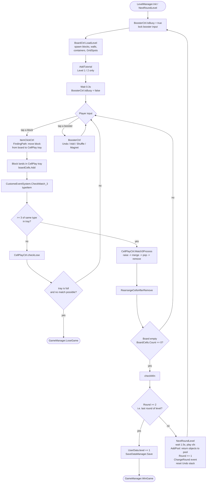
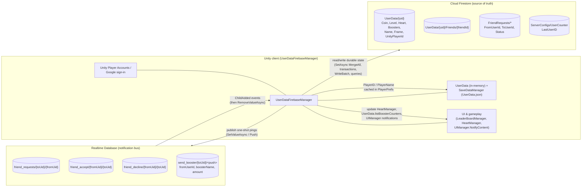
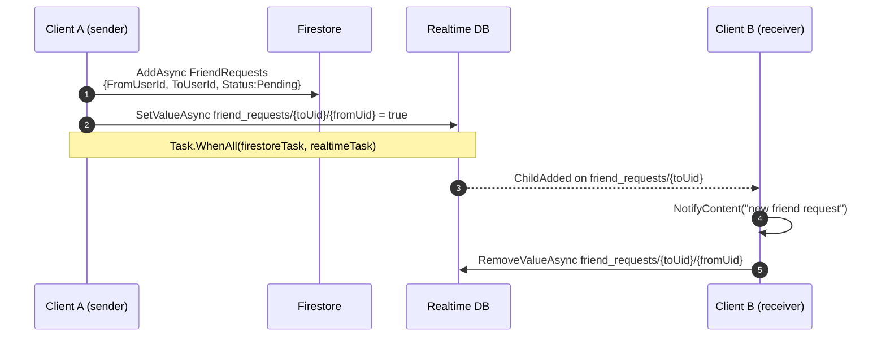
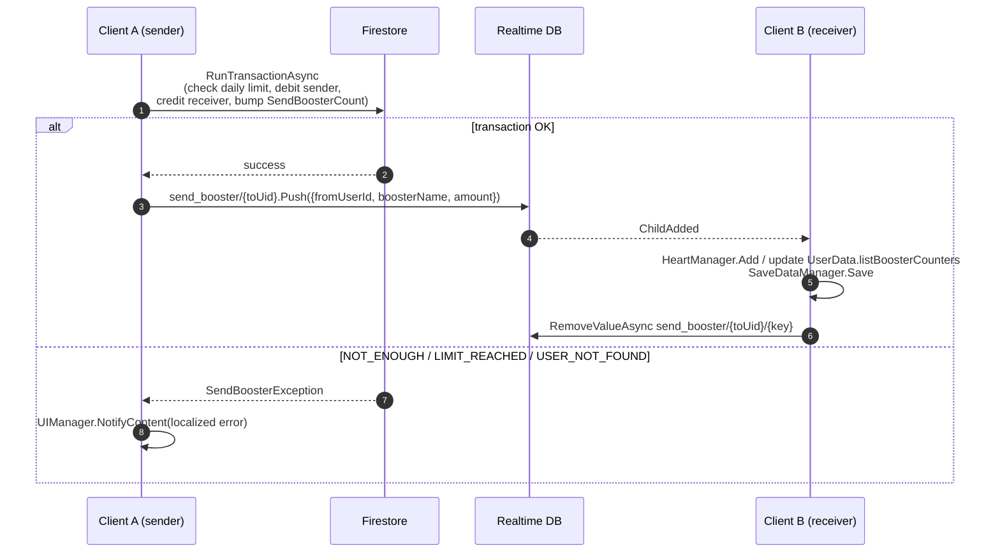

# BlockJam3D — Architecture Doc

This document covers two diagrams:

1. The main loop of a **round** during gameplay.
2. The Firebase architecture (**Cloud Firestore** + **Realtime Database**) and how they cooperate.

All diagrams use Mermaid so they render directly in GitHub / VS Code preview.

---

## 1. Main loop of a round

A *level* is a list of `LevelData` rounds (`LevelManager.levelDatas`), indexed by `LevelManager.Round`. `Round 0..2` are the three boards of a level; `Round > 2` triggers level win.

Entry point: `LevelManager.Init()` → `LoadLevel()` (first round) → player interaction → `CellPlayCtrl.Match_3` → on board cleared → `NextRoundLevel()` → next round or win.

### Key files

| Concern | File |
|---|---|
| Round orchestration | `Assets/Scripts/LevelManager/LevelManager.cs` |
| Board spawning / cells | `Assets/Scripts/LevelManager/Board/BoardCtrl.cs` |
| Tray, match‑3, win/lose checks | `Assets/Scripts/LevelManager/CellPlay/CellPlayCtrl.cs` |
| Tap → move | `Assets/Scripts/LevelManager/Board/ItemClickCtrl.cs` |
| Boosters | `Assets/Scripts/LevelManager/Booster/*` |
| Event bus | `Assets/Scripts/CustomeEvent/CustomeEventSystem.cs` |
| Pool reuse between rounds | `Assets/Scripts/ObjPool/*` |

### Notes

- `BoosterCtrl.IsBusy` is the gate that blocks booster input during transitions (start of round, mid‑match anim, end‑of‑round).
- `isNextRound` and `isCheckWin` are reentrancy guards; both are necessary because `CheckMatch_3` can fire repeatedly while merge animations are still resolving.
- Tutorials are hard‑coded for `Level == 1` (Click, Order) and `Level == 2` round 1 (Pipe); see `LevelManager.AddTutorial`.

---

## 2. Firebase architecture — Firestore + Realtime Database

The project uses **two** Firebase backends side‑by‑side, each playing a distinct role:

- **Cloud Firestore** — *source of truth*. Stores durable user data: profile, coins, hearts, level, boosters, friends list, friend‑request records, server counters.
- **Realtime Database** (`https://blockjam3d-2072f-default-rtdb.asia-southeast1.firebasedatabase.app`) — *notification channel*. Stores short‑lived "ping" nodes that listeners watch to drive UI updates immediately on the receiving client. Each event is **deleted right after it is consumed** (`RemoveValueAsync`) so the node behaves like a one‑shot inbox, not a log.

Both are accessed through the singleton `UserDataFirebaseManager` (`Assets/Scenes/UserDataFirebaseManager.cs`, `SingletonDDOL`). It initializes after `FirebaseApp.CheckAndFixDependenciesAsync` succeeds.

### Roles at a glance

| System | Holds | Lifetime | Access pattern |
|---|---|---|---|
| Firestore `UserData/{uid}` | profile, coins, hearts, level, boosters | persistent | `GetSnapshotAsync` / `SetAsync(MergeAll)` / transactions |
| Firestore `UserData/{uid}/Friends/{friendId}` | friendship edges | persistent | batch writes (both sides) |
| Firestore `FriendRequests/*` | pending requests with `Status` | persistent until accepted/declined | query by `ToUserId` + `Status == Pending` |
| Firestore `ServerConfigs/UserCounter` | `LastUserID` for sequential IDs ≥ 10000000 | persistent | `RunTransactionAsync` |
| RTDB `friend_requests/{toUid}/{fromUid}` | "you have a request" ping | one‑shot, removed on receive | `ChildAdded` listener |
| RTDB `friend_accept/{fromUid}/{toUid}` | "your request was accepted" ping | one‑shot | `ChildAdded` listener |
| RTDB `friend_decline/{fromUid}/{toUid}` | "your request was declined" ping | one‑shot | `ChildAdded` listener |
| RTDB `send_booster/{toUid}/<push>` | gifted booster / heart payload | one‑shot | `ChildAdded` listener |

### Component diagram

### How they work together — example flows

#### a) Send friend request

Firestore stores the **durable, queryable** request (`GetMyFriendRequests` filters by `ToUserId` + `Status == Pending`). RTDB is only the doorbell.

#### b) Accept / decline

`AcceptFriendRequest` runs a Firestore `WriteBatch` that writes both `UserData/A/Friends/B` and `UserData/B/Friends/A`, deletes the `FriendRequests` doc, then writes `friend_accept/{fromUid}/{toUid}` in RTDB so the sender's client refreshes its friend list (`LeaderBoardManager.onUpdateFriendList`). `DeclineFriendRequest` mirrors this via `friend_decline/...`.

#### c) Gift booster / heart

The Firestore **transaction** is what makes this safe: atomic debit + credit + daily‑limit check (`MAX_SEND_PER_DAY = 3`, VN timezone). RTDB is only fired *after* the transaction succeeds, so receivers never see a phantom gift.

#### d) User ID generation

`GenerateUniqueId` runs a Firestore transaction on `ServerConfigs/UserCounter.LastUserID` starting at `10000000`. If it fails (offline) the client falls back to a timestamp‑derived ID. RTDB is not involved.

#### e) Google / Unity Player Account link

`LinkGoogleAccount` → Unity Player Accounts → Firestore query `WhereEqualTo("UnityPlayerId", ...)`. If a cloud account already exists, its data is pulled into local `UserData` and the RTDB friend listeners are restarted under the new `CurrentUserId`. If not, the local doc is merged with `UnityPlayerId` / `LoginType` / `GoogleLinkedAt`.

### Design rationale

- **Firestore = state, RTDB = events.** Querying ("get all pending requests where ToUserId = me") is easy in Firestore but awkward in RTDB; conversely RTDB's `ChildAdded` push semantics are cheaper and lower‑latency than a Firestore live listener for ephemeral notifications.
- **Events are self‑deleting.** Every RTDB listener calls `RemoveValueAsync` after handling the event so the node acts as an inbox, not a log — replays are impossible and storage stays bounded.
- **Transactions on the durable side.** Anything that involves resource accounting (booster send, user ID counter) is a Firestore transaction; the RTDB notification is only published on success.
- **Local mirrors.** `UserData` (static) + `SaveDataManager` JSON keep the game playable offline; Firestore is the eventual source of truth and is re‑applied on Google link.
